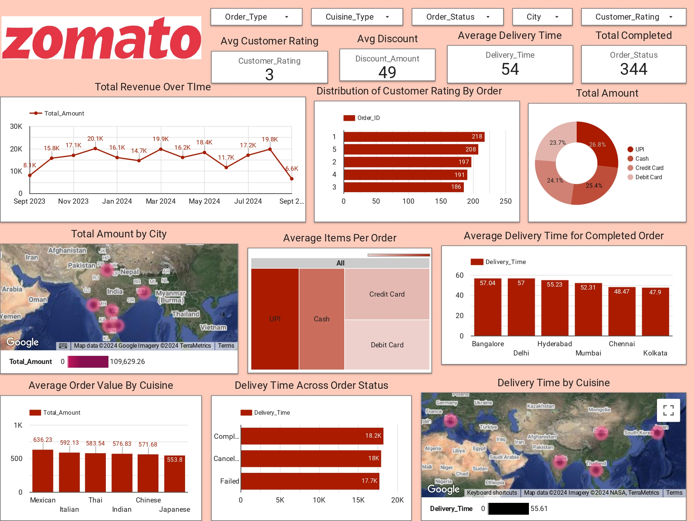

# Zomato Case Study: Analyzing Customer Retention and Operational Efficiency

## Problem Selection
Zomato has seen a decline in customer engagement and an increase in order cancellations. Key issues include:
- **Why are customers leaving?**
- **What is causing delivery delays and cancellations?**

These issues impact Zomato’s customer lifetime value, reputation, and competitive standing in the market. Addressing these problems is critical to maintaining market share and ensuring sustainable growth.

## Stakeholder Involvement

**Internal Stakeholders:**
- **Marketing Team:** Focuses on customer retention and engagement strategies.
- **Operations Team:** Manages delivery logistics to reduce delays and ensure efficiency.
- **Customer Support:** Addresses complaints, refunds, and cancellations.
- **Executive Leadership:** Requires high-level insights to guide business decisions.

**External Stakeholders:**
- **Customers:** Their satisfaction drives Zomato’s revenue and brand loyalty.
- **Restaurant Partners:** Play a role in order fulfillment and service quality.

## Problem Definition
The primary question to answer: **"What factors are driving customer dissatisfaction, leading to increased order cancellations and reduced repeat customers?"**

You have access to key data such as:
- Customer order history
- Restaurant performance
- Delivery times
- Payment methods

## Metrics Development
Key metrics to be explored include:
- **Average Delivery Time**
- **Order Cancellation Rate**
- **Customer Ratings**
- **Order Frequency**

## Data Dictionary

| Column Name       | Data Type | Description                                                         |
|-------------------|-----------|---------------------------------------------------------------------|
| Order_ID          | String    | Unique identifier for each order.                                    |
| Customer_ID       | String    | Unique identifier for each customer.                                 |
| Order_Date        | Date      | The date and time when the order was placed.                         |
| Restaurant_ID     | String    | Unique identifier for each restaurant.                               |
| Restaurant_Name   | String    | Name of the restaurant from which the order was placed.              |
| Cuisine_Type      | String    | Type of cuisine (e.g., Indian, Chinese, Mexican, etc.).              |
| Order_Amount      | Float     | The total amount spent by the customer on the order.                 |
| Delivery_Fee      | Float     | Fee charged for delivery.                                            |
| Total_Amount      | Float     | Final amount paid by the customer (Order_Amount + Delivery_Fee).      |
| Payment_Method    | String    | Method of payment (e.g., Credit Card, UPI, Cash).                    |
| Discount_Amount   | Float     | Discount applied to the order.                                       |
| Order_Status      | String    | Status of the order (e.g., Completed, Cancelled).                    |
| Delivery_Time     | Integer   | Time taken for the delivery in minutes.                              |
| Customer_Rating   | Integer   | Customer rating of the order (scale of 1 to 5).                      |
| City              | String    | The city in which the order was placed.                              |
| Restaurant_Rating | Float     | Average rating of the restaurant based on customer reviews.          |
| Number_of_Items   | Integer   | Total number of items in the order.                                  |
| Order_Type        | String    | Type of order (e.g., Delivery, Dine-in, Takeaway).                   |

## Analysis Plan

1. **Total Completed Orders:**  
   - **Visualization:** Scorecard  
   - **Measure:** Count of completed orders (Order_Status = "Completed")

2. **Average Delivery Time Across Cities:**  
   - **Visualization:** Bar Chart  
   - **Measure:** Average Delivery_Time (filtered by Order_Status = "Completed")

3. **Most Used Payment Method:**  
   - **Visualization:** Pie Chart  
   - **Measure:** Count of orders by Payment_Method

4. **Revenue Trend Over Time:**  
   - **Visualization:** Time Series Chart  
   - **Measure:** Sum of Total_Amount grouped by Order_Date

5. **Top Revenue-Generating City:**  
   - **Visualization:** Geo Map  
   - **Measure:** Sum of Total_Amount by City

6. **Customer Ratings Distribution:**  
   - **Visualization:** Histogram  
   - **Measure:** Count of orders grouped by Customer_Rating

7. **Cuisine with Highest Average Order Value:**  
   - **Visualization:** Column Chart  
   - **Measure:** Average Total_Amount grouped by Cuisine_Type

8. **Delivery Time by Order Status:**  
   - **Visualization:** Stacked Bar Chart  
   - **Measure:** Sum of Delivery_Time grouped by Order_Status

9. **Delivery Time by Cuisine Type:**  
   - **Visualization:** Heat Map  
   - **Measure:** Average Delivery_Time by Cuisine_Type

10. **Average Items Per Order by Payment Method:**  
    - **Visualization:** Treemap  
    - **Measure:** Average Number_of_Items grouped by Payment_Method

## Resources

- **Google Sheet Link:**  
  [Zomato Looker Case Data](https://lookerstudio.google.com/s/ikSE07TKrQM))  
  _Note: Create a copy of this sheet for use._

- **Looker Studio Tutorial:**  
  [Google Data Studio Tutorial](https://blog.coupler.io/google-data-studio-tutorial-for-beginners)

